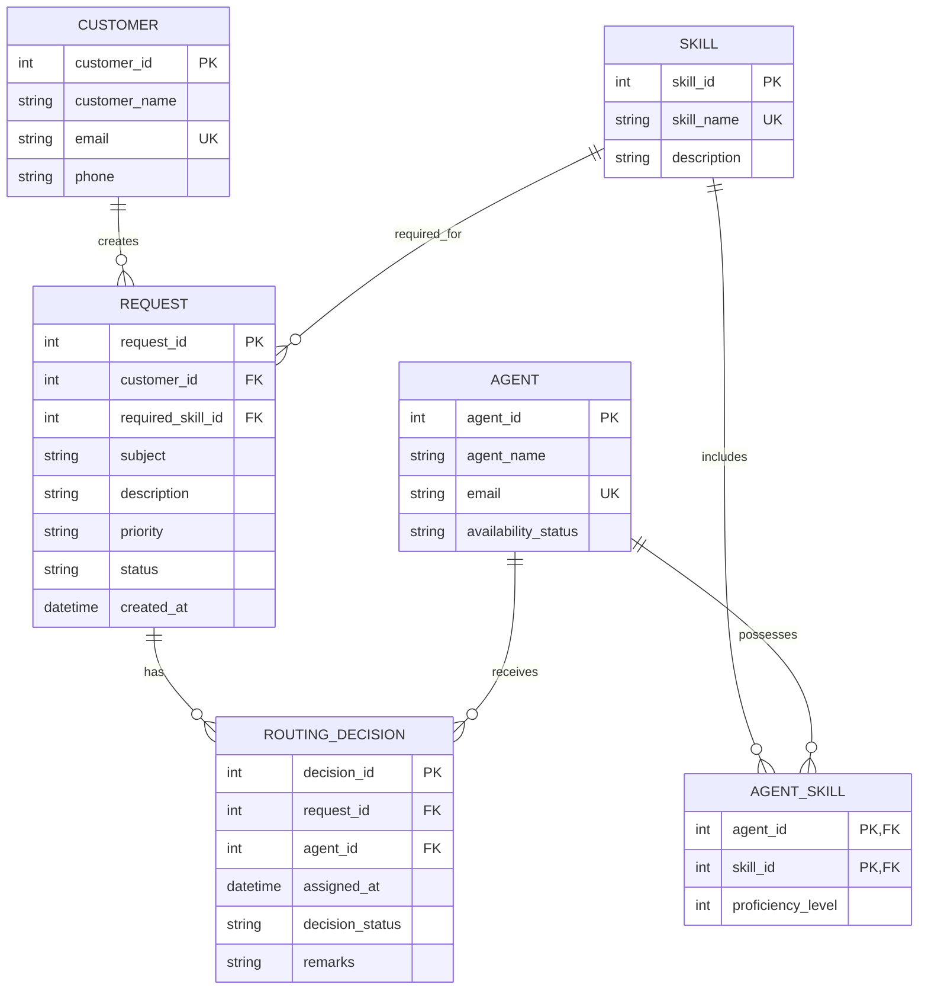

# QueueFlowDB - Entity Relationship Diagram

```mermaid
erDiagram
    CUSTOMER ||--o{ REQUEST : creates
    SKILL ||--o{ AGENT_SKILL : includes
    AGENT ||--o{ AGENT_SKILL : possesses
    SKILL ||--o{ REQUEST : required_for
    REQUEST ||--o{ ROUTING_DECISION : has
    AGENT ||--o{ ROUTING_DECISION : receives

    CUSTOMER {
        int customer_id PK
        string customer_name
        string email UK
        string phone
    }

    AGENT {
        int agent_id PK
        string agent_name
        string email UK
        string availability_status
    }

    SKILL {
        int skill_id PK
        string skill_name UK
        string description
    }

    AGENT_SKILL {
        int agent_id PK, FK
        int skill_id PK, FK
        int proficiency_level
    }

    REQUEST {
        int request_id PK
        int customer_id FK
        int required_skill_id FK
        string subject
        string description
        string priority
        string status
        datetime created_at
    }

    ROUTING_DECISION {
        int decision_id PK
        int request_id FK
        int agent_id FK
        datetime assigned_at
        string decision_status
        string remarks
    }
```
